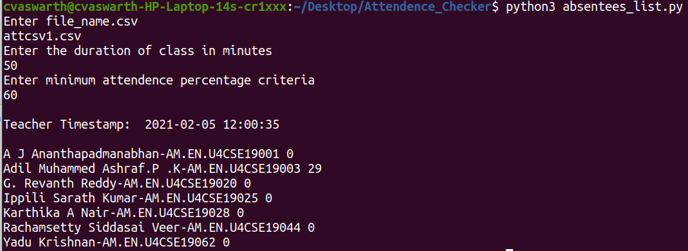

# Teams Attendence List Parser
## Pre-requisites
The first step should be cloning the repo
```
  git clone 
```
You should have the latest version of pip installed in your system.
For Ubuntu first execute the following command and check the version of the pip.
``` 
  pip --version
```
If you get an error like "Command not found" then execute the command metioned here:
```
  sudo apt install python3-pip
```
For windows check for step 3 and 4 in the following [documentation](https://www.liquidweb.com/kb/install-pip-windows/)

After you have successfully installed pip in your system you need to execute the following command
```
  pip install -r requirements.txt
```
Now you have installed all the dependencies to exectue the above code.

## Inructions for executing the code
#### STEP 1
Place the attendence list that you downloaded from teams in the attendenceLists folder.
#### STEP 2
For executing the code you can either execute it using idle or using the command prompt.
The command line instructions for Ubuntu
```
  python3 absentees_list.py
```
If you get an error saying python3 command not found then try using python or execute it using idle.
#### STEP 3
The sample execution screenShot is as follows:

First input is the attendence list file name
Second input is the class duration
Third input is the minimum percentage of the time that the student needs to be present to get the attendence.<br/>
Teacher timestamp is the time when the teacher logged in.<br/>
The output can be seen as the student name, roll No and the total number of minutes that he spent in the meeting (0 means the student was absent). The names of all those students whose meeting time is less then the given percent of the time are printed as output.


